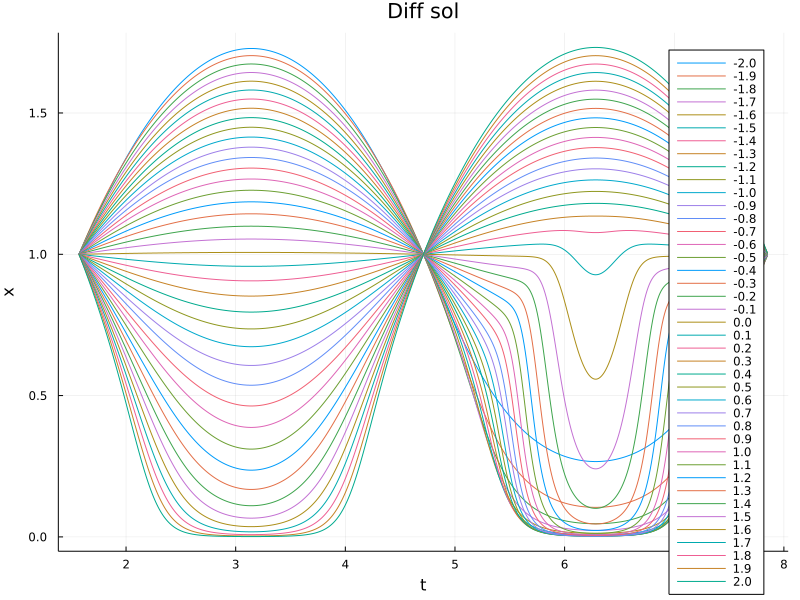

## Solution

#### a)
At |$\mu$| -> 1, things get funky. At higher values, point becomes attracting. Especially at ~2.9 (magnitude)

#### b)
Obtained by solving the differential equation. Essentially non autonomous
