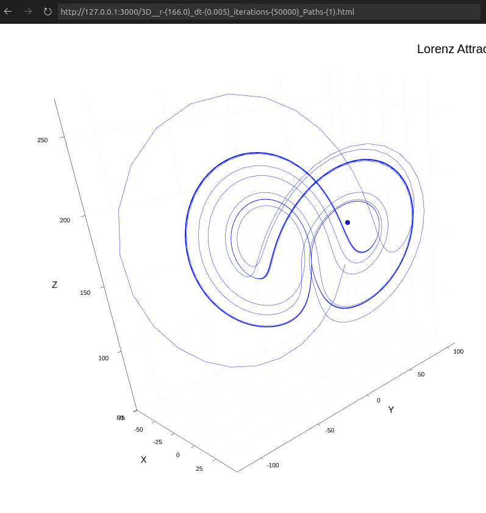
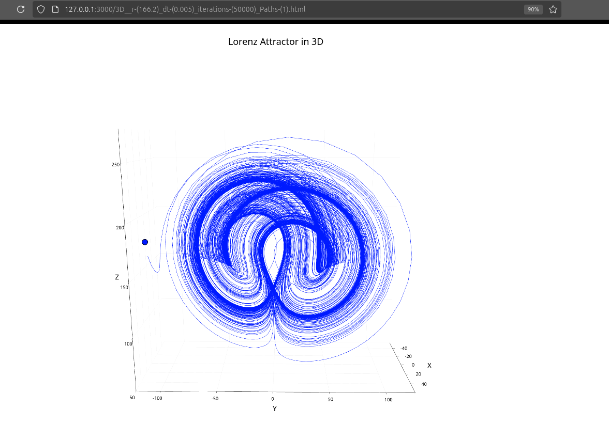
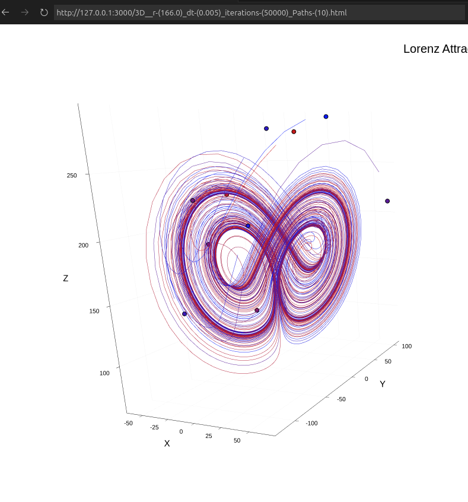
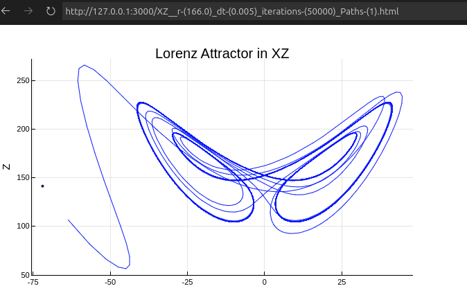
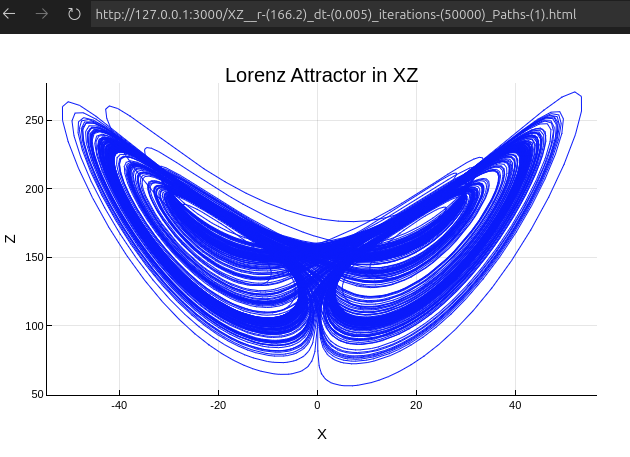
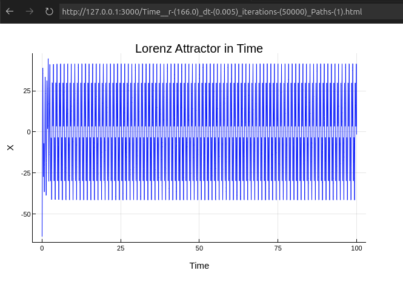
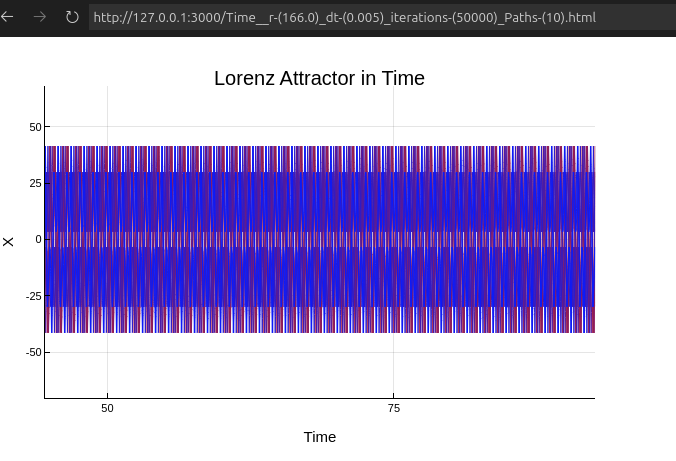
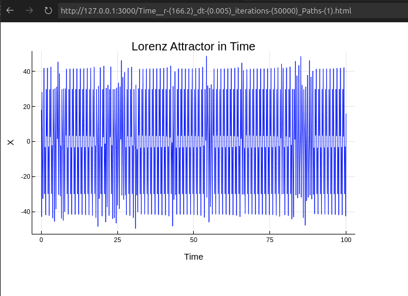
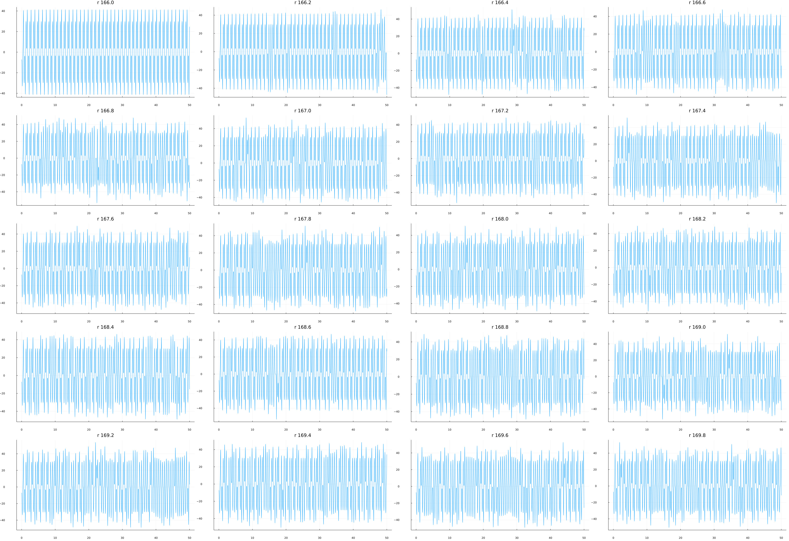

## Lorenz attractor

#### File structure
There exist two main Julia files:
1.  `lorenz.jl`
2. `lorenzWithTime.jl`
  
1 is used for section a and b while 2 is used for section c

>Warning
This sim was run on a laptop with 10 available threads and 16 gb of ram. The program is ram intensive. Be sure to turn down the iterations or paths before running if your device cannot support it. 

The image and html fles are names according to simulation hyperparameters. 
Note: 1p and 10p correspond to 1 and 10 paths respectively. ie, no of trajectories

#### Running the code and output

If you wish to simply view the **interactive** graphs, use the html files. Paste them onto your browser!

To run the code itself use the following command on the terminal
```julia
julia --threads 4 lorenz.jl
```
Similar for `lorenzWithTime.jl`
You will find images being generated. More specifically you will find **html** files(for `lorenz.jl`) being generated. Paste the file path of these files into your browser to get the interactive graph.

The following types of output are available for `lorentz.jl`
- Lorenz attractor in 3D
- XZ projection of lorenz attractor
- x(t) vs t

For the `lorenzWithTime.jl` , you will recieve an image output that compares x(t) vs t for various r values - `bursts_r-variation.png`

## a)
#### Limit cycles
All trajectories DO lead into a stable limit cycle.
This can be shown by simply plotting the lorenz attractor for that r value:

The bright blue line is the limit cycle.
In comparision, this the plot for the same parameters with the exception of r being 166.2:

No limit cycles


The trajectories for multiple paths is also plotted for r = 166


Though it may *seem* complex, all of them converge. It would have been a LOT more messier if they didnt. 
Each point marker corresponds to a different starting point (Better viewed in the interactive graph, ie html file)

---

#### XZ projection

The XZ projection for 1 path:

This converges to a stable limit cycle.
If would be a lot messier if it didnt.
Case in point, here is the graph for r = 166.2 and all other parameters the same:


---

#### X(t) vs time

The x(t) vs time for the case of r = 166 is very uniform with the exception of the initial transience.

Even when multiple starting points are used, we dont find any visible deviations once transience has decayed



## b) 
#### Intermittent bursts
The graphs for r=166.2 have all been shown above. However, this effect of chaotic bursts is most visible when the x(t) vs t graph is viewed:

This is in contrast with r=166 which showed uniform evolution. Here there exist sharp and unpredictable disturbances in the evolution of the state.

Interactive `html` plots are available for viewing


## c) 
#### Variation of bursts with variation in r

The plots of different x(t) vs t is plotted using `lorenzWithTime.jl`
The pattern is obvious and it can be seen that as r increases the 'randomness' increases.


If the image is not visible, please download it and view it via a different image displayer.
