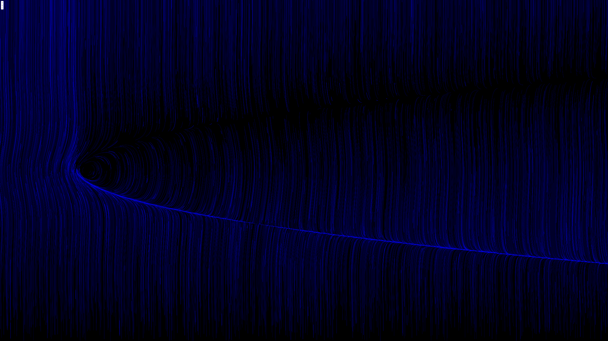
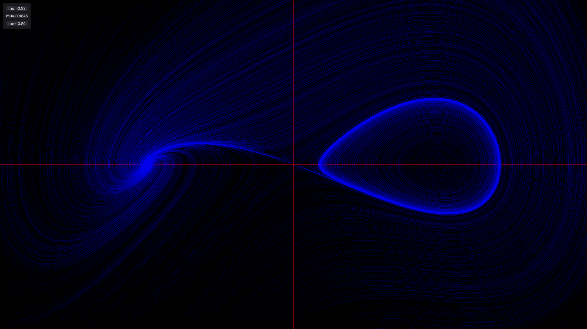

## AE454 - Dynamics and Bifurcation

The respective assignments can be found in their folders.
The online navigator can be found here: [https://sam-martis.github.io/AE454/](https://sam-martis.github.io/AE454/)

Expect cool pictures:

Assignment3/q1

Assignment3/q2/

Assignment3/q3

Foolish errand to find the fractal dimension of an orbit diagram using Quad trees:

Assignment2/q6

Assignment2/q2

